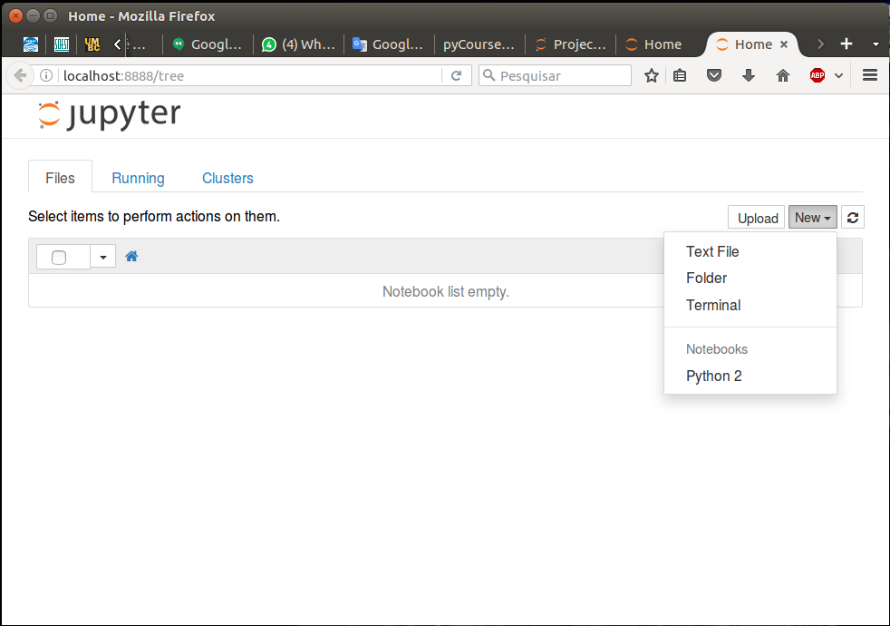

========
pyCourse
========

.. image:: https://readthedocs.org/projects/pycoursedoc/badge/?version=latest
   :target: http://pycoursedoc.readthedocs.io/en/latest/?badge=latest
   :alt: Documentation Status

It is a introductory Python Course, and the purpose is to give a overview of
this language. The course will cover points like data types, operators, to 
work with array, to work with table, to make graph, and to make maps.

Curiosity
---------
Python was developed by `Guido Van Rossum <https://gvanrossum.github.io/>`_. 
The language name does not came from *sweet* reptile. That comes from comedy 
series "Monty Python's Flying Circus". If you want to see some of Monty 
Python's movies, here is `Monty Python's Life of Brian <https://youtu.be/
r0Xf8IGuuIk>`_.

Requirements
------------
To take a better advantage of this course, the student should install 
`Anaconda <https://www.continuum.io/downloads>`_ (python distribution).
This distribution has a large number of libraries pre installed.

Jupyter Notebook
----------------

The main development environment used during this course is the `Jupyter Notebook 
<http://jupyter.org/index.html>`_. If you already installed Anaconda, you have to
open a terminal and to run the Jupyter Notebook.

.. code-block:: console

   $ jupyter notebook

After to run it, the following message will appear

.. code-block:: console

   [I 22:45:52.397 NotebookApp] Serving notebooks from local directory: /home/userName/projects
   [I 22:45:52.397 NotebookApp] 0 active kernels 
   [I 22:45:52.397 NotebookApp] The Jupyter Notebook is running at: http://localhost:8888/
   [I 22:45:52.398 NotebookApp] Use Control-C to stop this server and shut down all kernels (twice to skip confirmation).

end the browser will show a new tab like this 

Data set  
--------

The data set for this course is available in xxxxxxxx.

       
